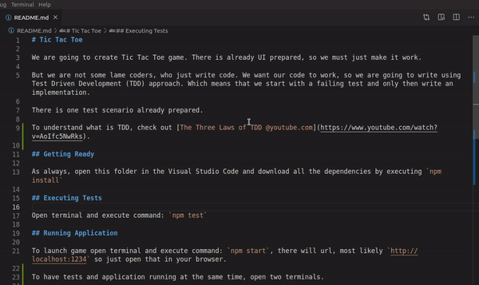

### Tic Tac Toe

## Getting Ready
Open this folder in the Visual Studio Code and download all the dependencies by executing `npm install`

## Executing Tests
Open terminal and execute command: `npm test`

## Running Application
To launch the game open terminal and execute command: `npm start`, at the end of the process description you will find a URL, most likely `http://localhost:1234` so just open that in your browser.

To have tests and application running at the same time, open two terminals.

## Game Rules
- a game is over when all fields in a row are taken by a player
- players take turns taking fields until the game is over
- a game is over when all fields in a diagonal are taken by a player
- a game is over when all fields are taken
- there are two players in the game (X and O)
- a game has nine fields in a 3x3 grid
- a game is over when all fields in a column are taken by a player
- a player can take a field if it is not already taken# Tic-Tac-Toe-Game

## Game is deplayed here (You may need to resize the screen): 
# https://elastic-goldwasser-559708.netlify.app/
